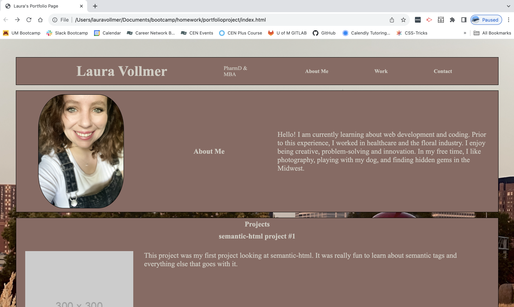

# portfolioproject
Portfolio project to display an About Me, Work and Contact sections for a future employer.

## projectdescription
I created a portfolio project website for display of my website projects using HTML, and CSS. Features I am worked on include responsive design, styling, incorporating a background image and profile picture image. Additionally, I added links to navigate the page through a navigation bar, each placeholder image, and the contact me section. A feature to work on in the future includes replacing the placeholder images with my upcoming projects.

In this project, I learned about flexbox, CSS styling, incorporating links and images.

## usage

Screenshot of finished project for portfolio project webpage.

Website Link: https://lavollmer.github.io/portfolioproject/

## credit

Received support from AskBCS. AskBCS helped with merging two unrelated branches in git bash when I was having trouble. It was unrelated to the code.

AskBCS helped with with styling the navbar horizontally. I worked with it a lot within CSS styling after talking with AskBCS, so I am unsure what code remains from their help in the final product.

They recommended this code below:

header {
  display:flex;
}

/* Style the top section */
section.toppage {
  background-color: darkblue;
  color: bisque;
  font-weight: bold;
  display: flex;
  justify-content: space-between; /* To push the navigation to the right */
  align-items: center; /* Vertically align items */
}

/* Style the navigation */
nav ul {
  display: flex; /* Display the list items in a row */
}

nav li {
  margin-right: 20px; /* Adjust spacing between menu items as needed */
}

Received support from tutoring services. Tutor discussed topic of linking navigation bar to sections on page, but did not give specific code. Tutor recommended including box-sizing, margin:0px , and padding:0px within the * portion of the CSS for styling purposes.

Received support from class lectures at U of MN Bootcamp Fall 2023.

## license

MIT License